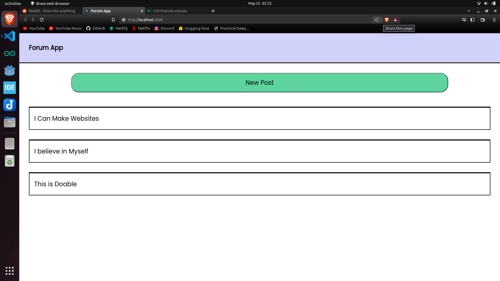

## Purpose

To learn and demonstrate MERN Stack and Authentication.

## Demo

## Setup

## Done

- See posts (posts in database, fetched to front end)
- Add posts
- Basic Styles
- Basic Login and Signup
- Add JSON Web Token and Cookies

## TODO

### Functionality

- Post Ordering
- Add Password Encryption
- See Specific posts and comments[router functionality]

### Style

- Hover State

### Extra Feature

### Code Improvement

- Make Error Handler
